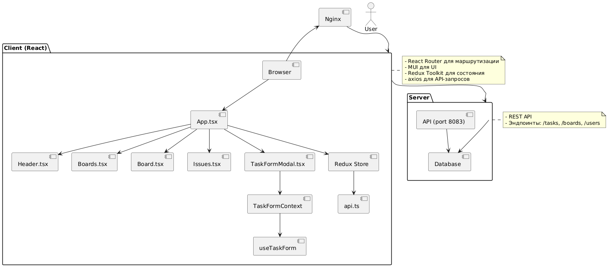
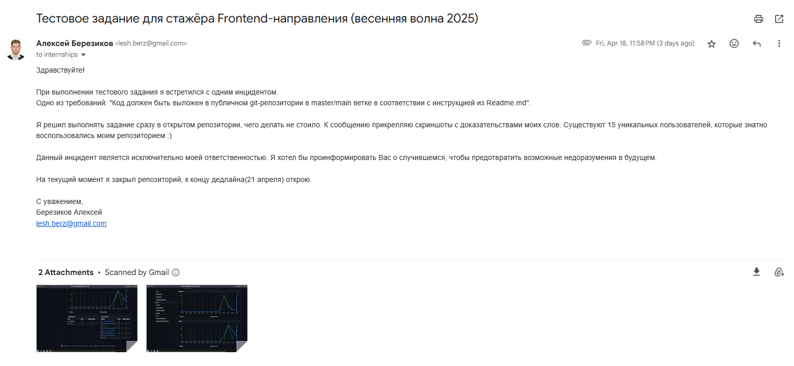
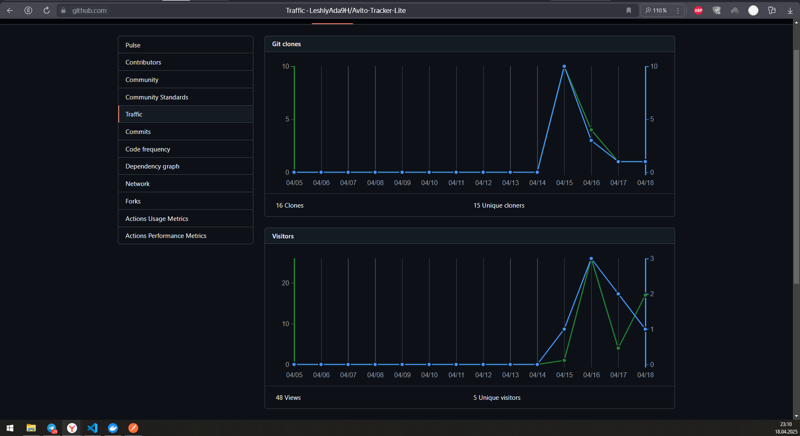
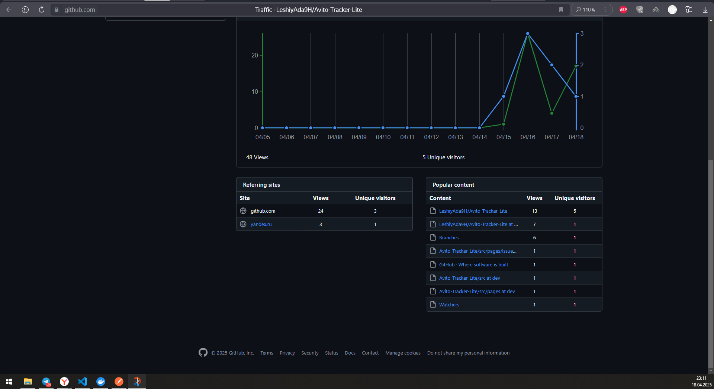

# Avito-Tracker-Lite

Мини-версия системы управления проектами, разработанная как тестовое задание для стажера по направлению Frontend. Приложение позволяет создавать и управлять задачами, организовывать их на досках с поддержкой drag-and-drop, а также фильтровать задачи по различным критериям. Проект включает клиентскую и серверную части, развернутые в Docker-контейнерах.

## Основные возможности

✅ **Управление задачами**: Создание, редактирование и просмотр задач с указанием названия, описания, приоритета, статуса, исполнителя и привязки к доске.

✅  **Доски**: Отображение досок с задачами в виде колонок (To do, In progress, Done) с поддержкой перетаскивания задач.

✅  **Фильтрация задач**: Поиск задач по названию, исполнителю, статусу и доске на странице "Все задачи".

✅  **Навигация**: Удобный интерфейс с хедером для перехода между страницами "Все задачи" и "Проекты".

✅  **Контейнеризация**: Развертывание клиентской и серверной частей через Docker Compose.

## Технологии

- **Node.js**: v18 (для сборки и разработки)
- **React**: v18+ с TypeScript для построения пользовательского интерфейса
- **react-router-dom**: Для клиентской маршрутизации
- **Material-UI (MUI)**: UI-компоненты с кастомизацией под стиль Avito
- **Redux Toolkit**: Управление глобальным состоянием (задачи, доски, статус загрузки)
- **axios**: Для выполнения HTTP-запросов к серверу
- **react-toastify**: Для отображения уведомлений
- **@hello-pangea/dnd**: Для реализации drag-and-drop функционала
- **Vite**: Быстрая система сборки с поддержкой HMR
- **ESLint & Prettier**: Линтинг и форматирование кода
- **TypeScript**: Строгая типизация для повышения надежности
- **Docker**: Контейнеризация клиентской и серверной частей
- **Nginx**: Статический хостинг клиентского приложения в продакшене

## Требования

✅ **Node.js**: v18+
✅ **Docker** и **Docker Compose** (для контейнеризации)
✅ **Браузер**: Современные версии Chrome, Firefox, Safari или Edge
✅ **Сервер**: Доступный сервер на порту 8083 (предоставляется в папке `server`)

## Установка и запуск

### Локальный запуск

1. Склонируйте репозиторий:

   ```bash
   git clone https://github.com/LeshiyAda9H/Avito-Tracker-Lite.git
   cd Avito-Tracker-Lite
   ```

2. Установите зависимости клиента:

   ```bash
   cd client
   npm install
   ```

3. Запустите сервер (порт 8083):

   ```bash
   cd ../server
   make initial-start
   ```

   Убедитесь, что сервер работает и доступен по адресу `http://localhost:8083/api/v1`.

4. Запустите клиент в режиме разработки:

   ```bash
   cd ../client
   npm run dev
   ```

   Приложение будет доступно по адресу `http://localhost:5173`.

### Запуск в Docker
К сожалению не работает должным образом, встретился с ошибкой CORS... Знаю, что могу с части клиента починить через прокси, но не получилось 😭

Если исправить, то следуйте инструкции:

1. Убедитесь, что Docker и Docker Compose установлены.

2. В корневой папке проекта выполните:

   ```bash
   docker-compose up --build
   ```

3. Дождитесь сборки и запуска контейнеров. Приложение будет доступно по адресу `http://localhost:80`.

4. Для остановки контейнеров:

   ```bash
   docker-compose down
   ```

## Структура проекта

- `client/` — Клиентская часть приложения
  - `src/api/` — Сервисы для взаимодействия с сервером (`api.ts` для HTTP-запросов).
  - `src/components/` — Переиспользуемые компоненты:
    - `Header.tsx` — Навигационная панель.
    - `TaskFormModal/TaskFormModal.tsx` — Модальное окно для создания/редактирования задач.
    - `ErrorBoundary.tsx` — Обработка ошибок рендеринга.
  - `src/pages/` — Страницы приложения:
    - `Boards.tsx` — Список всех досок.
    - `board/Board.tsx` — Страница конкретной доски с drag-and-drop.
    - `issues/Issues.tsx` — Страница всех задач с фильтрацией.
  - `src/hooks/` — Пользовательские хуки:
    - `useTaskForm.ts` — Хук для управления формой задачи.
  - `src/context/` — Контексты для управления состоянием:
    - `TaskFormContext.tsx` — Провайдер контекста формы задачи.
    - `TaskFormContextDefinition.ts` — Типы для контекста.
  - `src/data/` — Интерфейсы данных:
    - `taskFormData.ts` — Определения типов для задач, досок и пользователей.
  - `src/utils/` — Утилиты:
    - `statusMapping.ts` — Маппинг серверных и UI статусов задач.
  - `src/store/` — Управление состоянием через Redux:
    - `index.ts` — Настройка store, редюсеры и thunk-действия.
  - `src/App.css`**,** `src/index.css` — Глобальные стили (пока заглушки).
  - `src/components/TaskFormModal/styles.ts` — Стили для модального окна.
  - `src/pages/board/styles.ts` — Стили для страницы доски.
  - `src/pages/issues/styles.ts` — Стили для страницы задач.
  - `vite.config.ts` — Конфигурация Vite для сборки.
  - `eslint.config.js` — Правила линтинга для TypeScript и React.
  - `tsconfig.json`**,** `tsconfig.app.json`**,** `tsconfig.node.json` — Конфигурации TypeScript.
- `server/` — Серверная часть (порт 8083, подробности в `server/README.md`).
- `client/Dockerfile` — Контейнер для клиентской части (React + Nginx).
- `docker-compose.yml` — Конфигурация для запуска клиента и сервера в Docker.

## Архитектура приложения

### Клиентская часть

- **Маршрутизация**: Используется `react-router-dom` для навигации между страницами (`/issues`, `/boards`, `/board/:boardId`).
- **Управление состоянием**:
  - **Redux Toolkit**: Хранит задачи, доски, задачи по доскам, состояние загрузки и ошибки.
  - **Контекст**: `TaskFormContext` управляет состоянием модального окна задачи.
- **UI**: Material-UI для компонентов (TextField, Select, Button) с кастомными стилями через `sx` пропсы.
- **API**: `axios` для запросов к серверу (`http://localhost:8083/api/v1`).
- **Drag-and-drop**: Реализован с помощью `@hello-pangea/dnd` для перемещения задач между колонками.

### Серверная часть

- Сервер предоставляет API на порту 8083 для работы с задачами, досками и пользователями.
- Эндпоинты: `/tasks`, `/boards`, `/users`, `/tasks/create`, `/tasks/update/:taskId`, `/tasks/updateStatus/:taskId`.

### Docker

- Клиент: Сборка React-приложения с Node.js, раздача через Nginx.
- Сервер: Сборка серверной части с healthcheck и томом для данных.
- Сеть: Мостовая сеть `app-network` для связи между клиентом и сервером.

## Обоснование выбора технологий

- **Vite**: Быстрая сборка, поддержка HMR и оптимизация для продакшена.
- **Material-UI**: Готовые компоненты, гибкая кастомизация и поддержка тем.
- **Redux Toolkit**: Упрощает управление сложным состоянием (задачи, доски, асинхронные запросы).
- **axios**: Надежный клиент для HTTP-запросов с поддержкой типизации.
- **TypeScript**: Повышает надежность кода и упрощает рефакторинг.
- **Docker**: Обеспечивает воспроизводимость окружения и упрощает развертывание.
- **@hello-pangea/dnd**: Простая и мощная библиотека для drag-and-drop.

## Ограничения и предположения

- Сервер предполагается готовым и доступным на порту 8080 (был исправлен мною на порт 8083).
- Тесты (Jest, React Testing Library) упомянуты, но их реализация требует проверки.
- В коде используется Redux Toolkit для асинхронных запросов.
- Прерывание запросов реализовано частично через `AbortController` в `Boards.tsx`.

## Рекомендации по улучшению

1. **API**:
   - Добавить поддержку прерывания запросов в `api.ts` через `AbortController`.
   - Использовать React Query для кэширования и автоматического обновления данных.
2. **Стили**:
   - Заменить `App.css` и `index.css` на MUI ThemeProvider для глобальных стилей.
   - Добавить адаптивные стили для мобильных устройств.
3. **Производительность**:
   - Реализовать ленивую загрузку страниц с помощью `React.lazy` и `Suspense`.
   - Использовать виртуализацию списков для больших списков задач.
4. **Тестирование**:
   - Добавить юнит-тесты для компонентов, хуков и редюсеров с помощью Jest.
   - Настроить интеграционные тесты для проверки API-взаимодействий.
5. **Доступность**:
   - Добавить aria-атрибуты для кнопок и интерактивных элементов.
   - Проверить контрастность цветов в стилях MUI.
6. **Локализация**:
   - Вынести строки (например, "Создать задачу") в файлы локализации.
   - Поддерживать несколько языков для уведомлений и UI.

## PlantUML-диаграмма архитектуры



## Проверка требований

✅ **TypeScript, ESLint, Prettier**: Используются с настроенными конфигурациями (`eslint.config.js`, `tsconfig.json`).
❎ **Docker**: Полная поддержка через `Dockerfile` и `docker-compose.yml`.
✅ **Drag-and-drop**: Реализован с `@hello-pangea/dnd` в `Board.tsx`.
✅ **Прерывание запросов**: Частично реализовано в `Boards.tsx` с `AbortController`; требуется расширение для других запросов.
✅ **React Query**: Упомянут, но не используется; текущая реализация опирается на Redux Toolkit.

## Разработка и поддержка

Для добавления новых функций или исправления ошибок:

1. Создайте ветку: `git checkout -b feature/your-feature`.
2. Внесите изменения и протестируйте: `npm run dev`.
3. Проверьте линтинг: `npm run lint`.
4. Создайте PR с описанием изменений.

## Личные комментарии

### Tests
Признать, никогда должным образом не работал с тестами, на скорую руку попытался реализовать. Считаю, что дать мне день, тогда бы всё прекрасно получилось бы 😁

### Docker
Получилась печальная история... файлы и код реализовал, всё билдится, но встретился с CORS ошибками... По итогу, нет соединения между client и server. Попытался исправить, к сожалению, не получилось, а сроки поджимают.
Server запускал не совсем законно, поменял немного файлы, чтобы можно было обойтись без WSL, чисто на Windows.
Перейти на WSL не сложно было бы, но это тоже время.

### Немного о самозванцах

18.04.2025 (пятница) 
Написал на почту, которая была указанна в сообщении о приглашении на тестовое задание.


#### Скриншоты



### В целом о тестовом задании

Мне очень понравилось реализовывать данный проект! 

ТЗ не могу сказать, что максимально подробное, но хватает понять: что и как должно выглядить и работать. Сама работа показалось не прям сложная, однако очень много всего приходилось реализовывать, порой переписывать. 

В итоге, времени потраченного не жаль, своим результатом я весьма доволен и удовлетворён! 😎 
*(хоть можно было и лучше)*

Читателю всего хорошего и процветания!!! 😘